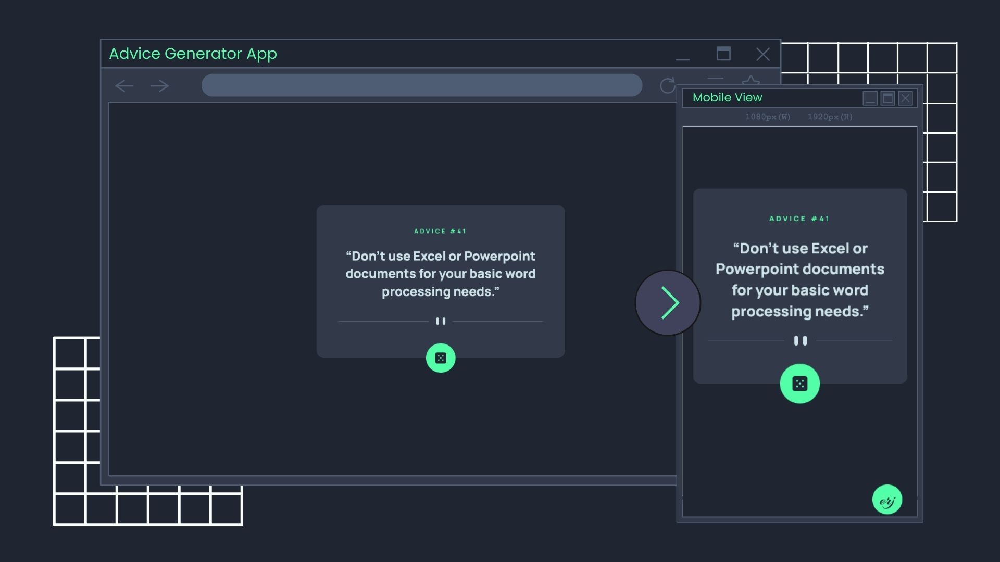

# Frontend Mentor - Advice generator app solution


  

This is a solution to the [Advice generator app challenge on Frontend Mentor](https://www.frontendmentor.io/challenges/advice-generator-app-QdUG-13db). Frontend Mentor challenges help you improve your coding skills by building realistic projects.

## Table of contents

- [Overview](#overview)
  - [The challenge](#the-challenge)
  - [Screenshot](#screenshot)
  - [Links](#links)
- [My process](#my-process)
  - [Built with](#built-with)
  - [What I learned](#what-i-learned)
  - [Continued development](#continued-development)
  - [Useful resources](#useful-resources)
- [Author](#author)
- [Acknowledgments](#acknowledgments)

## Overview

### The challenge

Users should be able to:

- View the optimal layout for the app depending on their device's screen size
- See hover states for all interactive elements on the page
- Generate a new piece of advice by clicking the dice icon

### Screenshot



### Links

- Solution URL: [https://github.com/ereljapco/frontendmentor/tree/main/advice-generator-app-main](https://github.com/ereljapco/frontendmentor/tree/main/advice-generator-app-main)
- Live Site URL: [https://advice-generator-erj.netlify.app/](https://advice-generator-erj.netlify.app/)

## My process

### Built with

- Mobile-first workflow
- Semantic HTML5 markup
- BEM methodology
- CSS custom properties
- Flexbox
- Vanilla JS

### What I learned

- Learned to use async function with await

```js
async function fetchAdvice() {
  try {
    adviceContainer.textContent = '...';
    const response = await fetch(adviceURL);

    if (!response.ok) {
      throw new Error(`Ooops. There was an error.`);
    }

    const data = await response.json();
    const { id, advice } = data.slip;

    adviceTitle.textContent = `Advice #${id}`;
    adviceContainer.innerHTML = `&ldquo;${advice}&rdquo;`;
  } catch (error) {
    adviceContainer.textContent = `Ooops. There was an error.`;
  }
}
```

### Continued development

I will be doing other challenges on FrontendMentor that uses APIs might. Those challenges might get me comfortable in using APIs.

### Useful resources

- [John Smilga's JS course](https://www.udemy.com/course/javascript-tutorial-for-beginners-w/?referralCode=DD9FA6C0D976918D3E1C) - Learned to use API and modules on this project-based course.

## Author

- Website - [Erel Japco](https://github.com/ereljapco)
- LinkedIn - [Erel Japco](https://www.linkedin.com/in/ereljapco/)
- Frontend Mentor - [@ereljapco](https://www.frontendmentor.io/profile/ereljapco)

## Acknowledgments

This is the first time to add attribution button that is fixed on the right bottom of the challenge. Inspired by [Daniel Den](https://denielden.github.io/).
