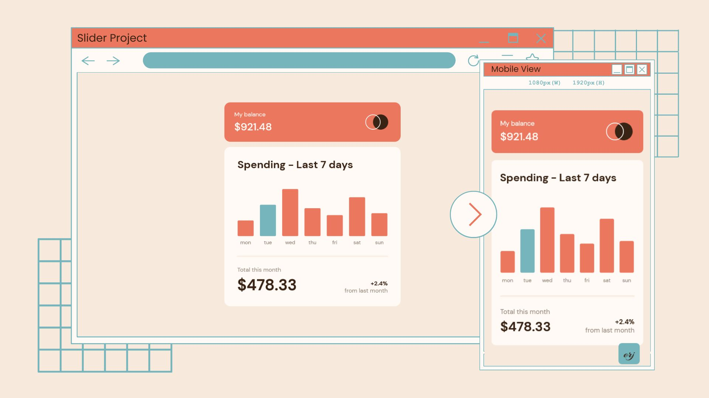
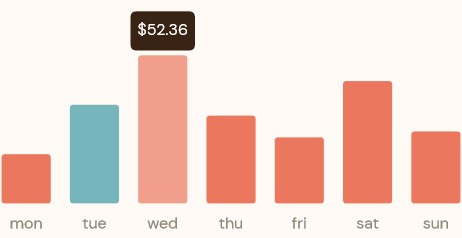
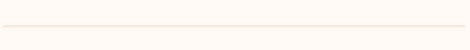

# Frontend Mentor - Expenses chart component solution


  

This is a solution to the [Expenses chart component challenge on Frontend Mentor](https://www.frontendmentor.io/challenges/expenses-chart-component-e7yJBUdjwt). Frontend Mentor challenges help you improve your coding skills by building realistic projects.

## Table of contents

- [Overview](#overview)
  - [The challenge](#the-challenge)
  - [Screenshot](#screenshot)
  - [Links](#links)
- [My process](#my-process)
  - [Built with](#built-with)
  - [What I learned](#what-i-learned)
  - [Continued development](#continued-development)
  - [Useful resources](#useful-resources)
- [Author](#author)

## Overview

### The challenge

Users should be able to:

- View the bar chart and hover over the individual bars to see the correct amounts for each day
- See the current day’s bar highlighted in a different colour to the other bars
- View the optimal layout for the content depending on their device’s screen size
- See hover states for all interactive elements on the page
- **Bonus**: Use the JSON data file provided to dynamically size the bars on the chart

### Screenshot



### Links

- Solution URL: [https://github.com/ereljapco/frontendmentor/tree/main/expenses-chart-component-main](https://github.com/ereljapco/frontendmentor/tree/main/expenses-chart-component-main)
- Live Site URL: [https://expenses-chart-c-erj.netlify.app/](https://expenses-chart-c-erj.netlify.app/)

## My process

### Built with

- Semantic HTML5 markup
- CSS custom properties
- Flexbox
- CSS Grid
- Mobile-first workflow
- Javascript

### What I learned

- Add a heading for page's outline without changing the visual design
  - I am learning to add accessibility to my projects and one problem I usually encounter in Frontend Mentor's challenges is the lack of heading for the components. Searching for solutions, I found [Accessibility Developer Guide](https://www.accessibility-developer-guide.com/)'s [Adding visually hidden headings to complete a page's outline](https://www.accessibility-developer-guide.com/examples/headings/visually-hidden-headings/).

```html
<section class="expenses-chart">
  <h1 class="expenses-chart__title">Expenses Chart</h1>
  <div class="expenses-chart-container"></div>
</section>
```

```css
.expenses-chart__title,
.summary__title {
  position: absolute;
  left: -100vw;
  width: 1px;
  height: 1px;
  overflow: hidden;
}
```

- Use Chart.js to add the animated bar chart
  - I was thinking of making the chart using HTML and CSS when I suddenly remember a tip I got from John Smilga's course - use libraries/tools to make it easier to implement a feature. It was easy to use Chart.js and display the data from the JSON file provided. I had a little bit of trouble in positioning the tooltip at the top of the bar on hover state. Fortunately, the documentation provided details that I have figured out to set the `xAlign` to 'center' and the `yAlign` to 'top'.



```js
const chart = new Chart(chartContainer, {
  // other properties here
  options: {
    plugins: {
      tooltip: {
        position: 'customPositioner',
        xAlign: 'center',
        yAlign: 'top',
      },
    },
  },
});
```

- Custom 3D-looking divider
  - I needed experimentation regarding the application of linear-gradient for this one. And this was the first time that I use the `groove` border-style. Thankfully, the divider looks good.



```css
.expenses__divider {
  display: block;
  width: 97%;
  height: 0.33em;
  background-image: linear-gradient(
    var(--clr-cream-500),
    var(--clr-cream-500),
    var(--clr-orange-100),
    var(--clr-orange-100)
  );
  border-radius: 100vh;
  border-bottom: 1px groove hsl(33, 100%, 96%);
  margin-bottom: 1.25em;
  margin-inline: auto;
}
```

### Continued development

I enjoyed using Chart.js. I helped me build the bar chart needed for the challenge. It also made me realize the importance of using the readily available tools to make feature implementation easier and faster.

From this, I intend on using other libraries, if I ever got to a Frontend Mentor challenge that needs one. And will definitely use Chart.js again in the future.

### Useful resources

- [Chart.js](https://www.chartjs.org/) - This helped me build the animated weekly expenses chart. Their documentation was really helpful.
- [Accessibility Developer Guide](https://www.accessibility-developer-guide.com/examples/headings/visually-hidden-headings/) - This helped me to add a heading tag to the `expenses-chart` section without changing the design visually.

## Author

- Website - [Erel Japco](https://github.com/ereljapco)
- LinkedIn - [Erel Japco](https://www.linkedin.com/in/ereljapco/)
- Frontend Mentor - [@ereljapco](https://www.frontendmentor.io/profile/ereljapco)
