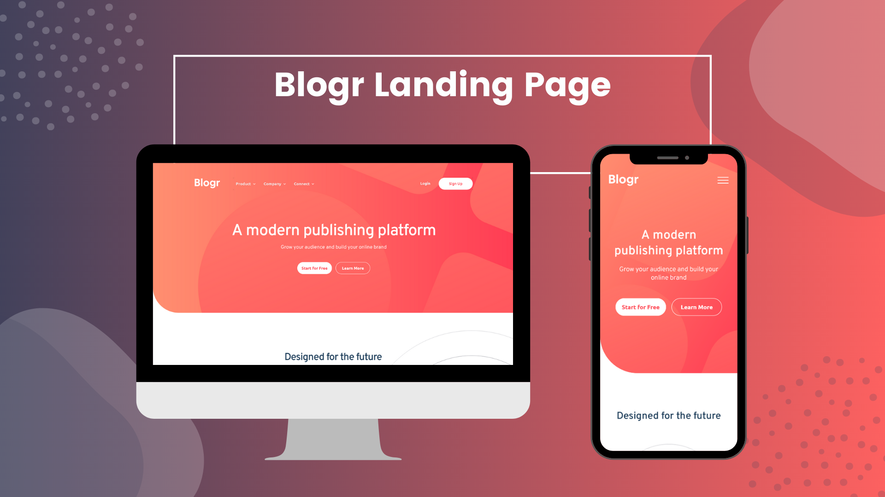

# Frontend Mentor - Blogr landing page solution

This is a solution to the [Blogr landing page challenge on Frontend Mentor](https://www.frontendmentor.io/challenges/blogr-landing-page-EX2RLAApP). Frontend Mentor challenges help you improve your coding skills by building realistic projects. 

[](https://app.netlify.com/sites/blogr-landing-page-byer/deploys)

## Table of contents

- [Overview](#overview)
  - [The challenge](#the-challenge)
  - [Screenshot](#screenshot)
  - [Links](#links)
- [My process](#my-process)
  - [Built with](#built-with)
  - [What I learned](#what-i-learned)
  - [Continued development](#continued-development)
  - [Useful resources](#useful-resources)
- [Author](#author)
- [Acknowledgments](#acknowledgments)

## Overview

### The challenge

Users should be able to:

- View the optimal layout for the site depending on their device's screen size
- See hover states for all interactive elements on the page

### Screenshot



### Links

- Solution URL: [Github](https://github.com/erelita/coding-challenges/tree/main/frontendmentor/junior/blogr-landing-page-main)
- Live Site URL: [Netlify](https://blogr-landing-page-byer.netlify.app)

## My process

### Built with

- Semantic HTML5 markup
- CSS custom properties
- Flexbox
- CSS Grid
- Mobile-first workflow
- Javascript

### What I learned

- Adding background image with linear-gradient. I also learned to be patient with sizing and positioning background images.

```css
.header {
    position: relative;
    background: url("../images/bg-pattern-intro-mobile.svg") 35.5% 34%/350vw no-repeat, linear-gradient(to bottom right, var(--clr-gradient-200), var(--clr-gradient-400));
    background-repeat: no-repeat;
    padding: 3.5em 1.5em 9.8em 1.5em;
    border-bottom-left-radius: 5rem;
}
```

- Using margin and translate to center overflow elements.

```css
.for-the-future__illustration img {
    width: 109vw;
    margin-left: 50%;
    transform: translateX(-50%);
}
```

- Using CSS min() and max() for responsiveness

- I learned to take one step at a time. I worked on getting as close as the mobile (375px width) and desktop (1440px) first then I try to make them as responsive as I can.

### Continued development

It took me more days than I thought it would because I was trying to get the measurements as close as the design provided by checking the live preview with the design's image.

The sizing and positiong of the SVG files was really a challenge for me. Through playing around with it, I was able to learn more. It's still not perfect, but I'm hoping that by finishing more challenges, I will be more familiar with those two.

### Useful resources

- [Stack Overflow - How do I combine a background-image and CSS3 gradient on the same element?](https://stackoverflow.com/questions/2504071/how-do-i-combine-a-background-image-and-css3-gradient-on-the-same-element) - This helped me to combine the use of a background image and linear-gradient.
- [W3Schools - CSS background-position Property](https://www.w3schools.com/cssref/pr_background-position.asp) - Helped me in using % to position the background image.
- [Stack Overflow - Center Oversized Image in Div](https://stackoverflow.com/questions/14562457/center-oversized-image-in-div/41059954) - [yunzen](https://stackoverflow.com/users/476951/yunzen)'s answer helped me center an overflowed image in the simplest way.

## Author

- Github - [https://github.com/erelita/](https://github.com/erelita/)
- LinkedIn - [https://www.linkedin.com/in/erelropeta/](https://www.linkedin.com/in/erelropeta/)
- Frontend Mentor - [https://www.frontendmentor.io/profile/erelita](https://www.frontendmentor.io/profile/erelita)
