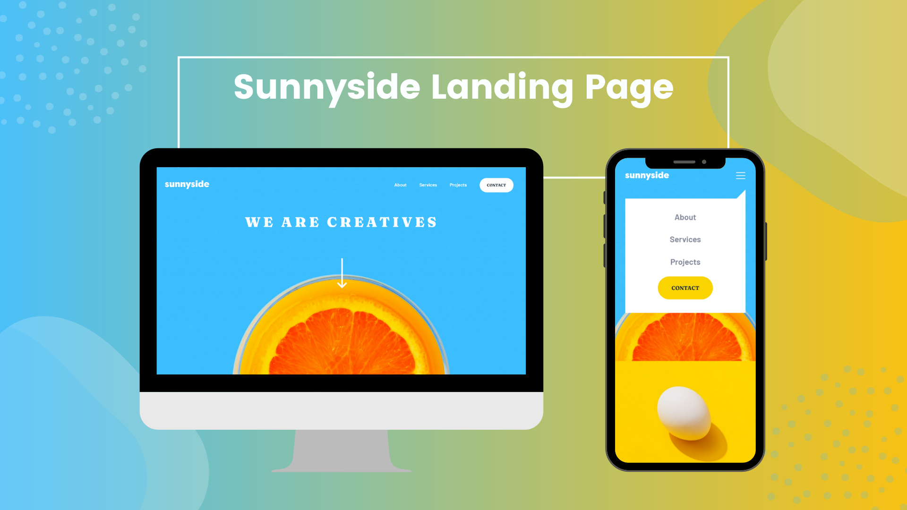

# Frontend Mentor - Sunnyside agency landing page solution

[](https://app.netlify.com/sites/sunnyside-agency-byer/deploys)

This is a solution to the [Sunnyside agency landing page challenge on Frontend Mentor](https://www.frontendmentor.io/challenges/sunnyside-agency-landing-page-7yVs3B6ef). Frontend Mentor challenges help you improve your coding skills by building realistic projects.

## Table of contents

- [Overview](#overview)
  - [The challenge](#the-challenge)
  - [Screenshot](#screenshot)
  - [Links](#links)
- [My process](#my-process)
  - [Built with](#built-with)
  - [What I learned](#what-i-learned)
  - [Useful resources](#useful-resources)
- [Author](#author)

## Overview

### The challenge

Users should be able to:

- View the optimal layout for the site depending on their device's screen size
- See hover states for all interactive elements on the page

### Screenshot



### Links

- Solution URL: [github](https://github.com/erelita/coding-challenges/tree/main/frontendmentor/junior/sunnyside-agency-landing-page-main)
- Live Site URL: [Netlify](https://sunnyside-agency-byer.netlify.app/)

## My process

### Built with

- Semantic HTML5 markup
- CSS custom properties
- Flexbox
- CSS Grid
- Javascript
- Mobile-first workflow

### What I learned

Making a hamburger menu using HTML + SVG.

```html
<div class="hamburger-menu">
  <button class="hamburger-icon" aria-label="Menu">
    
  </button>
</div>
<nav class="nav__mobile">
  <ul>
    <li><a href="#">About</a></li>
    <li><a href="#">Services</a></li>
    <li><a href="#">Projects</a></li>
    <li><button aria-label="Contact">Contact</button></li>
  </ul>
</nav>
```

Positioning mobile menu and adding transition using CSS.

```css
.nav__mobile {
    position: absolute;
    top: 2em;
    width: 100%;
    background-color: var(--clr-neutral-000);
    padding: 1em 0 2em 0;
    transition: transform 0.8s ease-in-out, opacity 0.8s ease-in-out;
    opacity: 0;
}

.nav--appear {
    transform: translateY(2em);
    opacity: 1;
}

.nav__mobile::after {
    content: '';
    position: absolute;
    top: -24px;
    right: 0;
    border-top: 12px solid transparent;
    border-right: 12px solid var(--clr-neutral-000);
    border-bottom: 12px solid var(--clr-neutral-000);
    border-left: 12px solid transparent;
}
```

Using addEventListener + toggle to hambuger-menu.

```js
hamburgerIcon.addEventListener('click', () => {
    headerNav.classList.toggle('nav--appear');
});
```

Use of grid-area.
```css
main {
    display: grid;
    width: 100%;
    grid-template-areas: 
    "transform      transform      egg           egg"
    "cup            cup            stand-out     stand-out"
    "graphic-design graphic-design photography   photography"
    "testimonials   testimonials   testimonials  testimonials"
    "gallery        gallery        gallery       gallery";
    grid-template-columns: repeat(4, 1fr);
    grid-template-rows: repeat(2, 1fr) 33em 43em 25em;
}
```

### Useful resources

- [Kevin Powell's Why CSS grid-area is the best property for laying out content](https://www.youtube.com/watch?v=duH4DLq5yoo&t=472s) - Was able to understand grid and grid-area more with Kevin's Youtube tutorial.
- [How to change the color of an svg element?](https://stackoverflow.com/questions/22252472/how-to-change-the-color-of-an-svg-element?rq=1) - Was initially using div tag and CSS mask for SVG icons, then I realized it wasn't working on Chrome. Read this thread on Stack Overflow and decided to use inline SVG for ease of use and browser compatibility.

## Author

- Website - [Erelita](https://github.com/erelita)
- Frontend Mentor - [@erelita](https://www.frontendmentor.io/profile/erelita)

