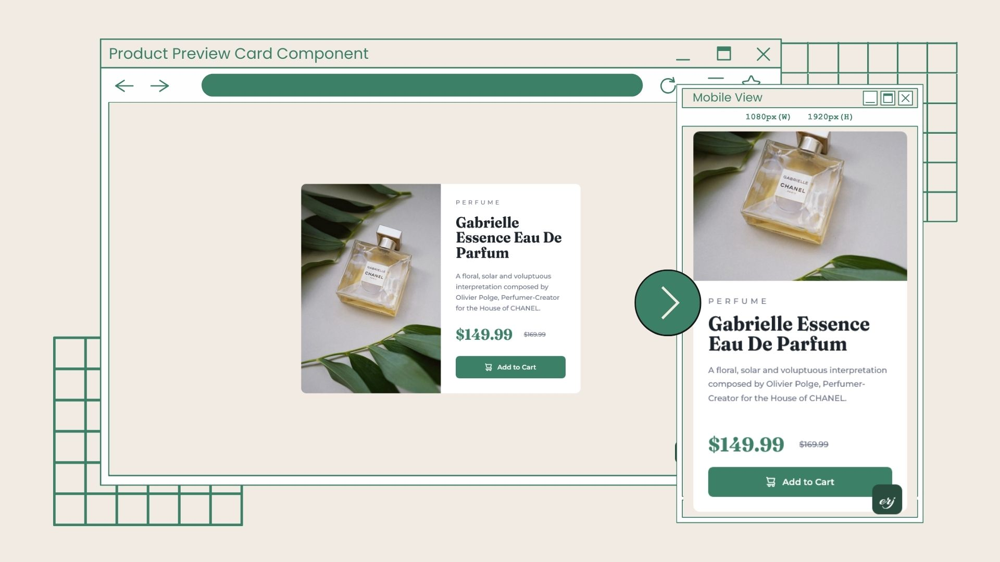

# Frontend Mentor - Product preview card component solution


 

This is a solution to the [Product preview card component challenge on Frontend Mentor](https://www.frontendmentor.io/challenges/product-preview-card-component-GO7UmttRfa). Frontend Mentor challenges help you improve your coding skills by building realistic projects.

## Table of contents

- [Overview](#overview)
  - [The challenge](#the-challenge)
  - [Screenshot](#screenshot)
  - [Links](#links)
- [My process](#my-process)
  - [Built with](#built-with)
  - [What I learned](#what-i-learned)
  - [Continued development](#continued-development)
  - [Useful resources](#useful-resources)
- [Author](#author)
- [Acknowledgments](#acknowledgments)

## Overview

### The challenge

Users should be able to:

- View the optimal layout depending on their device's screen size
- See hover and focus states for interactive elements

### Screenshot



### Links

- Solution URL: [https://github.com/ereljapco/frontendmentor/tree/main/product-preview-card-component-main](https://github.com/ereljapco/frontendmentor/tree/main/product-preview-card-component-main)
- Live Site URL: [https://product-preview-card-erj.netlify.app/](https://product-preview-card-erj.netlify.app/)

## My process

### Built with

- Semantic HTML5 markup
- CSS custom properties
- Flexbox
- CSS Grid
- Mobile-first workflow

### What I learned

- I get to use `transform scaleY()` on the title. I thought I can use font-stretch, it's not available for the font.

```css
.product__title {
  font-size: 1.87rem;
  font-weight: 600;
  line-height: 1;
  transform: scaleY(1.08);
  margin-block: 1rem 1rem;
}
```

### Continued development

I will do at least 1 challenge from Frontend Mentor every month. I think that I am getting better, but I still need to improve.

### Useful resources

- [Stack Overflow question - Change font height and width](https://stackoverflow.com/questions/32932288/change-font-height-and-width) - [Sebastian Simon](https://stackoverflow.com/users/4642212/sebastian-simon)'s answer worked best for the title of the preview card. Didn't know `transform: scale()` can be used on text.

## Author

- Website - [Erel Japco](https://github.com/ereljapco)
- LinkedIn - [Erel Japco](https://www.linkedin.com/in/ereljapco/)
- Frontend Mentor - [@ereljapco](https://www.frontendmentor.io/profile/ereljapco)
